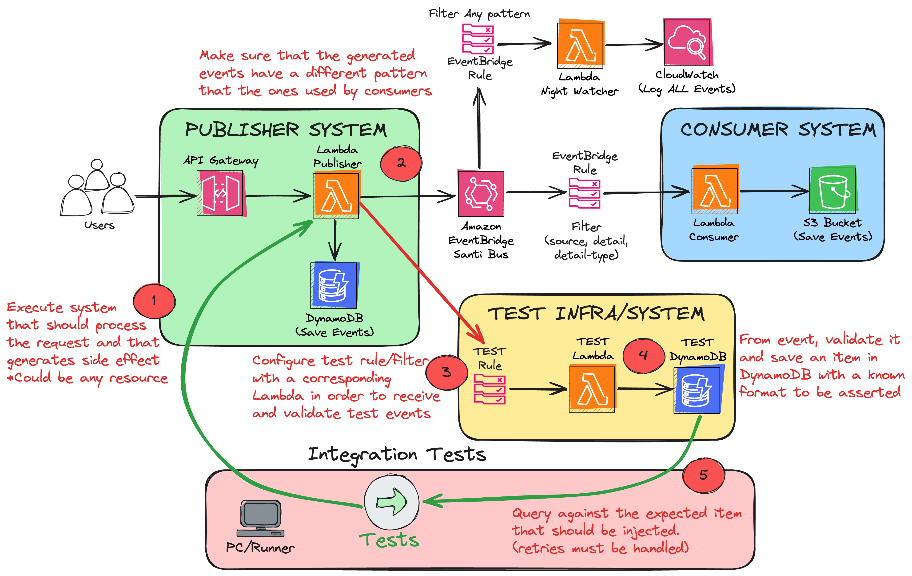

# AWS-CDK-MULTIPLE-EXPERIMENTS

This project covers multiple of my AWS Experiments in a simple fashion, so that they can be used by our communities and tutorials.  

## Projects :fast_forward:

### Event Driven Architecture Integration Tests

Best practices for running integration tests on top of Event-Driven systems (in this case Serverless on top of Lambda and EventBridge with a complete pub/sub decoupled example)

  

More Details: [event_driven_architecture_tests/README.md](./event_driven_architecture_tests/README.md)

---

### Cross Account Event Notifications

Decoupled Cross-Account EventBridge solution for notifying in a central AWS Account all "Backup Failures" from the "AWS Backup" service on any of the AWS Accounts of a given organization.

  

More Details: [cross_account_event_notifications/README.md](./cross_account_event_notifications/README.md)

---

### Custom Resource S3 Folders :open_file_folder:

AWS CloudFormation Custom-Resource built with AWS-CDK to upload "S3 Folders" at CDK deployment time.

  

More Details: [custom_resource_s3_folders/README.md](./custom_resource_s3_folders/README.md)

### S3 Cross Region Replication with KMS setup

Cross-Account and Cross-Region S3 buckets replication with custom managed KMS keys in place for an Active-Passive S3 bucket solution. Still requires multi-steps deployments, but is a good initial entrypoint.

  

Inspiration from: [aws-cdk-examples/tree/master/typescript/s3-kms-cross-account-replication](https://github.com/aws-samples/aws-cdk-examples/tree/master/typescript/s3-kms-cross-account-replication)

### Custom Emails with HTML and Attachments via Lambda and SES

Example on how to develop a custom-built SES solution to send customized template emails from Lambda Functions and Simple Email Service. The solution includes S3 buckets to host the images inside the HTML.

TODO: Add AWS architecture diagram.

<!--    -->

---

### OTHERS

TODO: Pending to add detailed README.md files and architectures.

## License

Copyright 2023 Santiago Garcia Arango.
