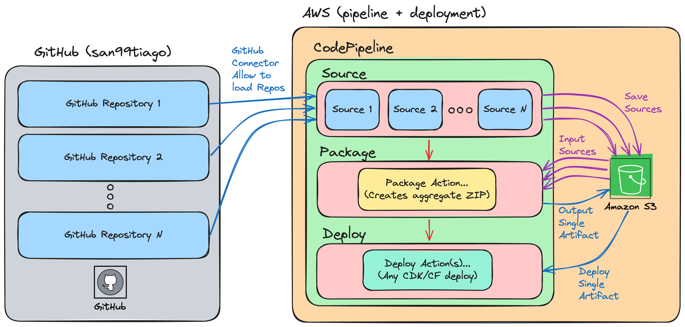

# CODEPIPELINE 2 SOURCES

This project is to illustrate how to create a CI/CD pipeline on AWS with CodeBuild and CodePipeline, that fetches 2 different GitHub Repositories, and somehow "integrates" them.

## Architecture

  

## Why this solution?

When there is an use case of requiring multiple Git Repositories as the "sources" of a specific Automation Pipeline, one of the challenges is to be able to fetch the repositories prior to starting the actual "deployment" stage.

- For example, referencing a given "Git Repository 1" with Infrastructure as Code, plus also needing some central configuration files from another "Git Repository 2"

## How it works?

The solution has a "CodePipeline Connection" with GitHub permissions to fetch 2 different GitHub Repositories. Then, the "source" stage is able to fetch both, save them as artifacts, and then "package" them in a following "CodeBuild Action" that generates a "single artifact" as a ZIP file that can be later used by the deployment stage.

Important steps prior to deploy the solution (manual steps):

1. Create a `CodePipeline Connection` that has permissions towards the necessary GitHub repositories.
2. Copy the connection's ARN to the `cdk.json` context to the key `code_pipeline_connector_arn`.
3. Replace the additional `cdk.json` parameters as needed:
   1. `sourceRepoOrg`: GitHub Organization for the sources (eg: `san99tiago`)
   2. `sourceRepo`: Source 1 GitHub Repository (eg: `aws-cdk-multiple-experiments`)
   3. `sourceBranch`: Source 1 GitHub Branch (eg: `main`)
   4. `source2Repo`: Source 2 GitHub Repository (eg: `aws-iac-stocks-demo`)
   5. `source2Branch`: Source 2 GitHub Branch (eg: `main`)
