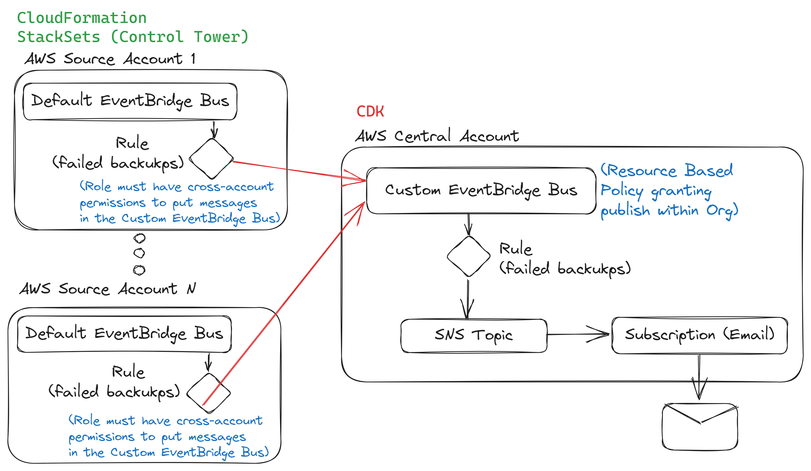

# CROSS-ACCOUNT-EVENT-NOTIFICATIONS

The purpose of this project is to show how to configure a decoupled Cross-Account EventBridge solution for notifying in a central SNS Topic all "Backup Failures" from the "AWS Backup" service on any of the AWS Accounts of a given organization.

- Hub Account: The central account that has a central EventBridge Bus for receiving the events and also sending the notifications to admin emails via an SNS Topic.
- Spoke Account(s): Can be multiple AWS Accounts that will have the AWS Backups service active, and any failure of a Backup will be sent to the central account for notifying to admins.

## Architecture

  

## Why this solution?

This solution is important, as of today (2023-06), there is no default AWS mechanism of publishing "AWS Backup" failure notifications to a cross-account SNS Topic. This means that we would have to notify failures to multiple SNS Topics on each account, which is not scalable for big organizations that have hundreds of AWS accounts.  

That being said, this solution solves the issue, by deploying a central "Hub Account" CDK Stack, and enables the deployment of multiple cross-account CF StackSets that are the "Spoke Account(s)", which will be connected to the "Hub Account", to enable the "central notification method" for the backup-failure events.

## How it works?

The details of the Infrastructure as Code is built on top of 2 AWS-CDK projects. The core components of them are:

- [./hub_account](./hub_account) --> Contains the Hub-Account resources:

  - SSMParameter: Contains the value of the AWS Organization ID (to enable access across all AWS Accounts).
  - EventBusConstruct: EventBridge Rule that matches any input event (all allowed, but could be limited if needed).
  - SNSTopicConstruct: SNS Topic and subscription for the admin emails of an organization.

- [./spoke_account](./spoke_account) --> Contains the Spoke-Account resources:

  - Spoke EventBus: Default EventBridge Bus to filter only the "backup failure" events from AWS Backup.
  - Hub EventBus: EventBridge Bus deployed on the Hub Account.
  - EventBridge Rule: EventBridge Rule that filters only the desired events.

Note: The "Hub Account" and "Spoke Account" are decoupled, so the order does not matter. However, both have to be deployed for the complete solution to work. I used CF StackSets to deploy the "Spoke Account" part, after running CDK-Synth, so that it can be easily deployed to all the AWS Accounts in an Organization via Control Tower Customizations.

## License

Copyright 2023 Santiago Garcia Arango.
