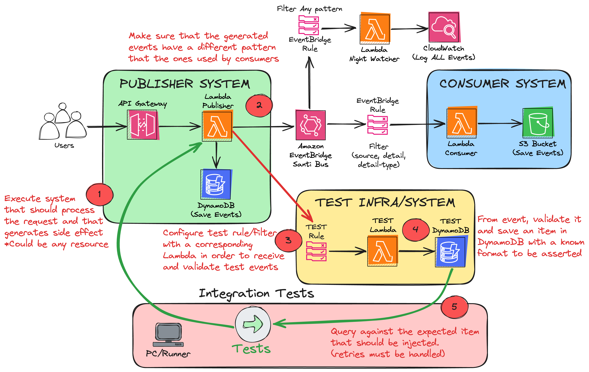

# EVENT DRIVEN ARCHITECTURE TESTS

## Architecture

  

## Why this solution?

One of the biggest challenges of designing Event Driven Architectures is to be able to testing them in an appropriate and reliable way. And to be more specific, to tackle these 2 scenarios:

- Publisher fails to send the event to EventBridge
- Subscriber does not receive/process the event correctly

In order to accomplish this challenge, I inspired in multiple online best practices to be able to correctly create valuable integration tests for Serverless Solutions that are event-driven:

- [How to test your EventBridge Integrations](https://serverlessfirst.com/eventbridge-testing-guide/)
- [Testing Event-Driven Applications Using EventBridge — A Four-Year Journey](https://medium.com/@smorland/testing-event-driven-applications-using-eventbridge-a-four-year-journey-8ed0c80fc4ca)
- [Test that an AWS EventBridge (or CloudWatch) Event Was Fired](https://stackoverflow.com/questions/60743785/test-that-an-aws-eventbridge-or-cloudwatch-event-was-fired)

## How it works?

The details of the Infrastructure as Code is built on top of 2 AWS-CDK projects. The core components of them are:

- [./publisher_system](./publisher_system) --> Contains the "Publisher System" resources:

  - API Gateway: Entrypoint for the solution (API that clients would use to interact with a given system)
  - Lambda Function: The runtime that process the API requests (sync). It is also in charge of sending an event to a specific EventBridge Bus, so that "consumers" can filter the events and process them in other external systems.
  - DynamoDB Table: Database that the given system would use to write/persist the requests. (useful for simulating real data in the publisher system).
    - \* Will allow us to validate that side effects do not occur when running integration tests.
  - EventBridge Bus: Due to the nature of the solution, the EventBridge bus is owned/managed by the publisher system (note: it could also exist outside in another context/app).

- [./consumer_system](./consumer_system) --> Contains the "Consumer System" resources:

  - EventBridge Rule: Enables the "filtering" of input events from the EventBridge Bus (the bus is owned externally). The events get sent to the consumer SQS queue.
  - SQS: Queue that is able to capture the events that arrive to the Bus (from a specific rule).
  - Lambda Function: The runtime that process the "consumer" requests. It simulates some business logic, and has a "data layer" which is an S3 bucket with some specific information about the processed events.
  - S3: Bucket to add some "data layer" for the consumer system.
    - \* Will allow us to validate that side effects do not occur when running integration tests.

- [./tests](./tests) --> Contains the "Integration Tests" for the systems:

- EventBridge Rule (Test Purposes): Enables the "filtering" of input events from the EventBridge Bus (the bus is owned externally). The events get sent to the Test SQS queue.
- SQS (Test Purposes): Dedicated SQS that the goal is to be able to run integration tests. It's not used for any system directly.

## License

Copyright 2024 Santiago Garcia Arango.
