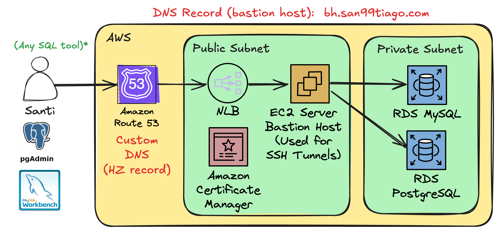

# RDS BASTION HOST

This solution demonstrates the deployment of Amazon RDS instances (MySQL or PostgreSQL) within private subnets, ensuring secure database access. A dedicated Bastion Host is set up in a public subnet with a custom DNS, allowing users to establish an SSH tunnel for secure, TCP/IP connections over SSH. This configuration enables the use of popular SQL client tools, such as MySQL Workbench or PGAdmin, to interact with the RDS instances without direct public access to the databases.

## Architecture

 <br>

## Why this solution?

This solution is to showcase how to deploy and connect to and RDS instance (e.g. MySQL or PostgreSQL), when they are created on a Private Network, and we still need to connect to them via MySQL Workbench or PostgreSQL.

## Manual Steps

Before deploying, create an EC2 Key Pair on AWS. Then, proceed to update the "cdk.json" with the "key_name" property populated with it.

## Usage

Deploy the solution via `cdk deploy`. Then proceed to test the connection by using a SQL Client tool, and configuring the option "TCP/IP over SSH", with these values:

- SSH Host: `bh.dev.san99tiago.com` (or the one specified in the CDK.json)
- SSH User Name: `ec2-user`
- SSH Authentication Method: `Public Key` (select the PEM file/key specified in the CDK.json)
- Database Host: `sample-db-postgresql.xxxxxxx.us-east-1.rds.amazonaws.com` (generated dynamically at deployment)
- Database Port: `5432` (PostgreSQL) or `3306` (MySQL)
- Database Username: `postgres` (PostgreSQL) or `admin` (MySQL)
- Database Password: `YYYYY` (generated dynamically at deployment)
  > Saved in AWS Secrets Manager Secret !!!

Note: The traditional "SSH" connectivity is still possible towards the EC2 instance:

```bash
ssh -i "gen-main.pem" ec2-user@bh.dev.san99tiago.com
```

## License

Copyright 2024 Santiago Garcia Arango.
