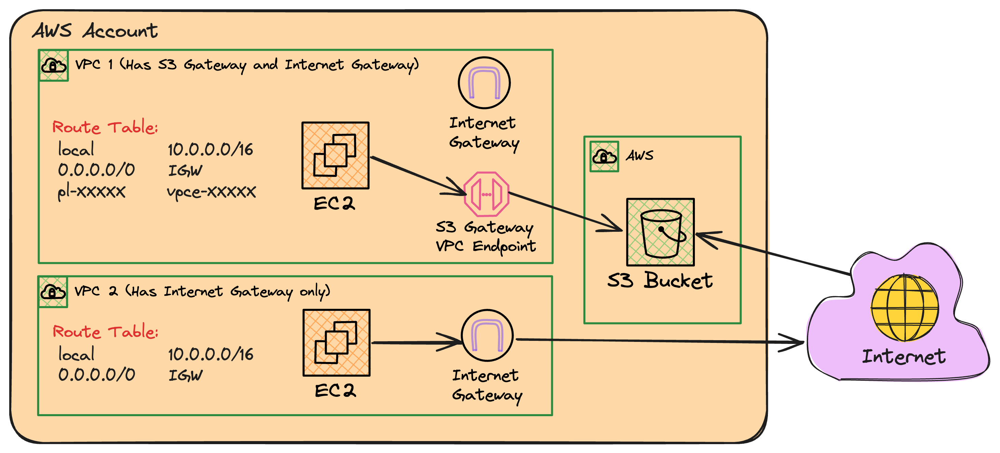

# VPC NETWORKING EXPERIMENTS

## Architecture

 <br>

## Why this solution?

The goal of this project is to explore how the traffic routes from different VPC configurations, such as:

- EC2 instance within VPC towards S3 Bucket
  - Via S3 Gateway (demo instance 01)
  - Via Internet (demo instance 02)

To validate the routing, I used the commands exposed in this post:

- [How do I check if my Amazon S3 traffic is going through a gateway VPC endpoint or an interface VPC endpoint?](https://repost.aws/knowledge-center/vpc-check-traffic-flow)

```bash
# Inside the EC2 instance (located inside each VPC), execute:
# ... note: replace "us-east-1" to main region
sudo traceroute -T -p 443 s3.us-east-1.amazonaws.com
```

Other option is via VPC Flow Logs (but not enabled for this example)
